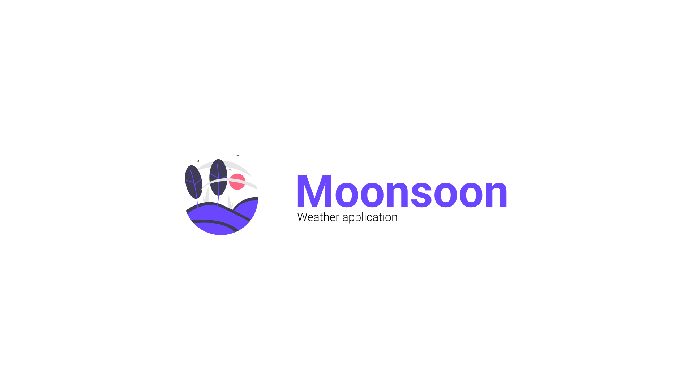
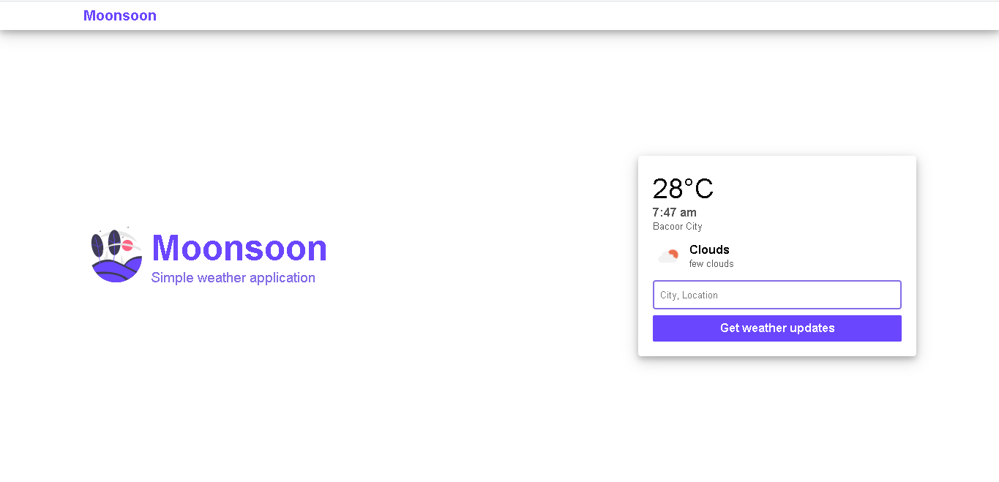
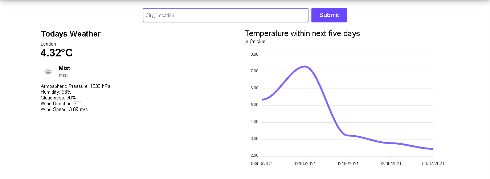
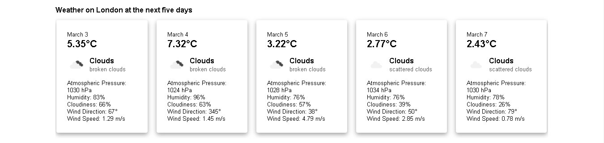

# Moonsoon Frontend v1


Consuming <a href="https://openweathermap.org/">OpenWeather API</a> using React JS



## Features

- Locating your location and give you the current weather
- Searching of city and getting its weather
- Give you the next 5 days' weather

## Live Demo

You can visit the site at [https://moonsoon.netlify.app/](https://moonsoon.netlify.app/)

## Installation

Requirements

- [NodeJS](https://nodejs.org/en/)
- [Git](https://git-scm.com/downloads)

Running it locally:
Get an API key from [Open Weather](https://openweathermap.org/) and create a .env file then copy the format in .env.example given

```
git clone https://github.com/Dahnnyboi/moonsoon.git
npm install
npm run start
```

## Sample Images





## Things to change in version 2

Look at [development branch](https://github.com/Dahnnyboi/moonsoon/tree/development) to see what improvements it needs
